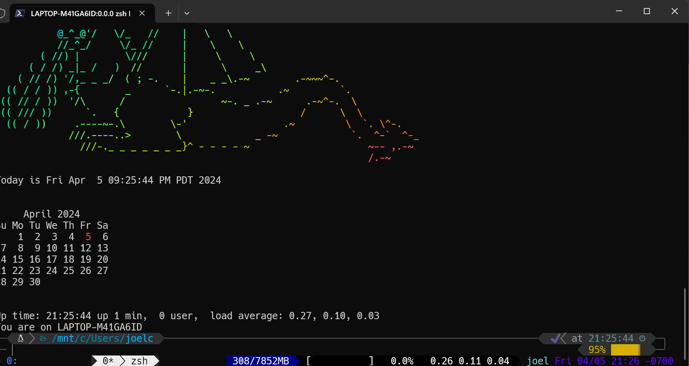
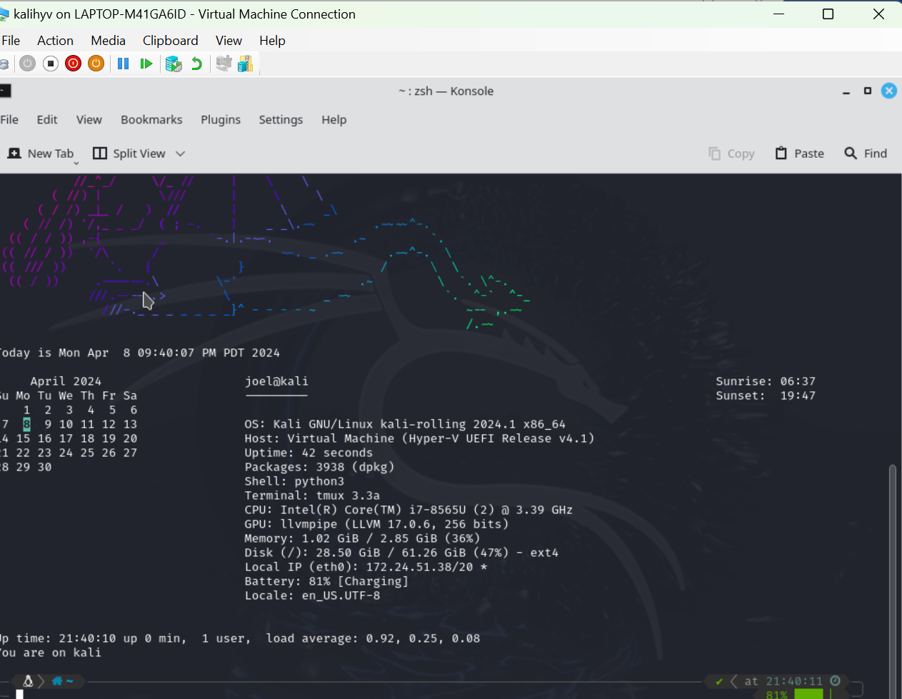
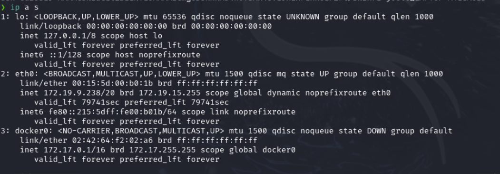

### Setting up the VM

I would like to have the option of using a WSL or hyperV setup on my windows machine, and also an option to use my native linux so I will be spinning up three separate Kali VM instances.  
#### WSL Instance
The wsl setup is easy cheesy.  Since I already had a kali instance setup with the setup.sh already ran, i just screenshotted the open instance.
WSL snapshot

#### hyper-V Kali Instance
I copied the powershell instructions into a file named 'setup.ps1', ran it and rebooted.  Downloaded the kali iso.  The command using powershell failed so I just downloaded the iso image manually. 

wget is a strange command.  When applying `wget https://dkmcgrath.github.io/courses/netsec/setup.html`, it grabs the html and everything.  As this is being written, it is very clear why that is the case.  I think there is a 'raw' ending that can be used to just grab the data in a page.  Anyways, I copy/pasted the script into a 'setup.sh' on the VM, chmod'd it:`chmod +x setup.sh`,and ran it.

Hyper-V snapshot
Here's a a screenshot.

IP a s
Screenshot of ip a s 

